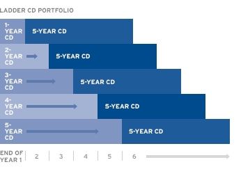

# laddering
#### Simple command-line utility for CD and bond laddering in Python
___

As described neatly on a [Citigold website](https://online.citi.com/US/JRS/pands/detail.do?ID=Laddering) describing an hypothetical $12,500 CD ladder:

> 1. Invest $2,500 in five CDs with a range of rates and maturity lengths. Each year of maturity is a step on the ladder.

>2. When the 1-year CD matures, contact us to reinvest that money in a new 5 year CD. By this time your original 5-year CD has only 4 years left until it matures.

>3. At the end of five years, you'll have five 5-year CDs on your ladder. One of those 5-year CDs will mature each year, giving you access to money that's been growing at the rates paid on 5 Year CDs.

